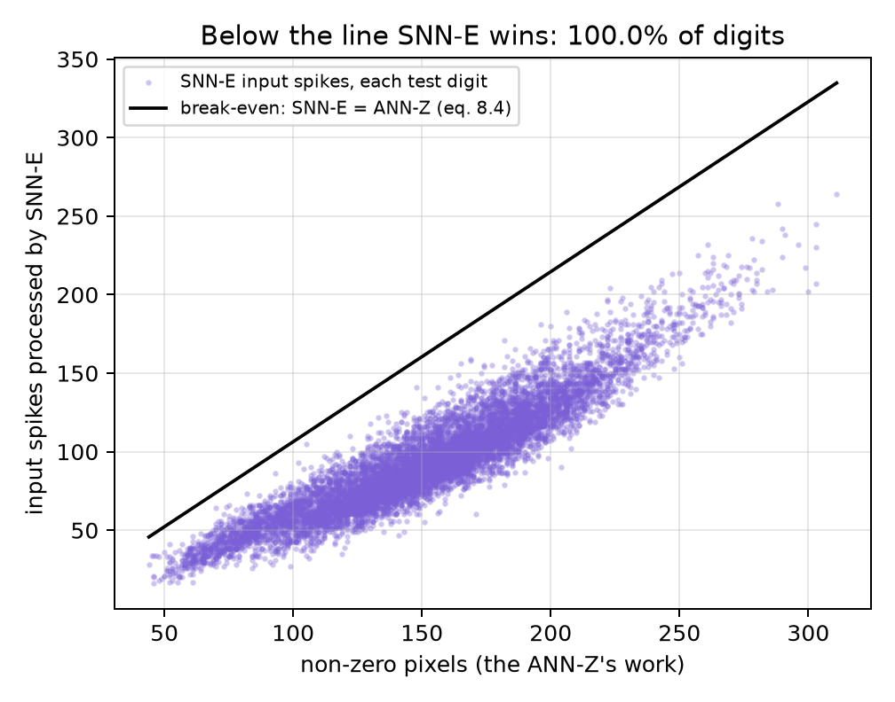
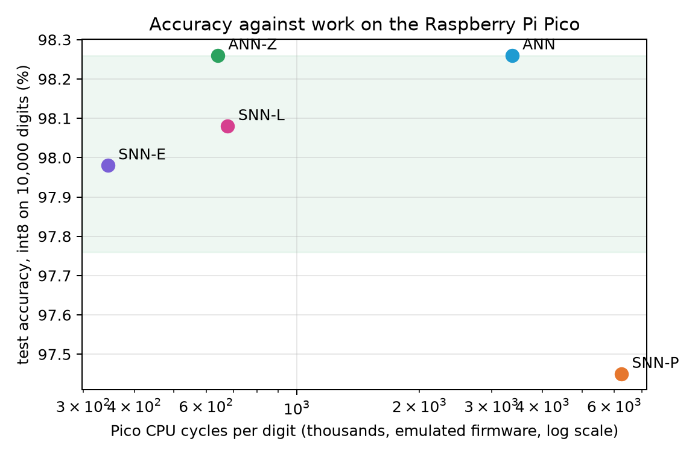
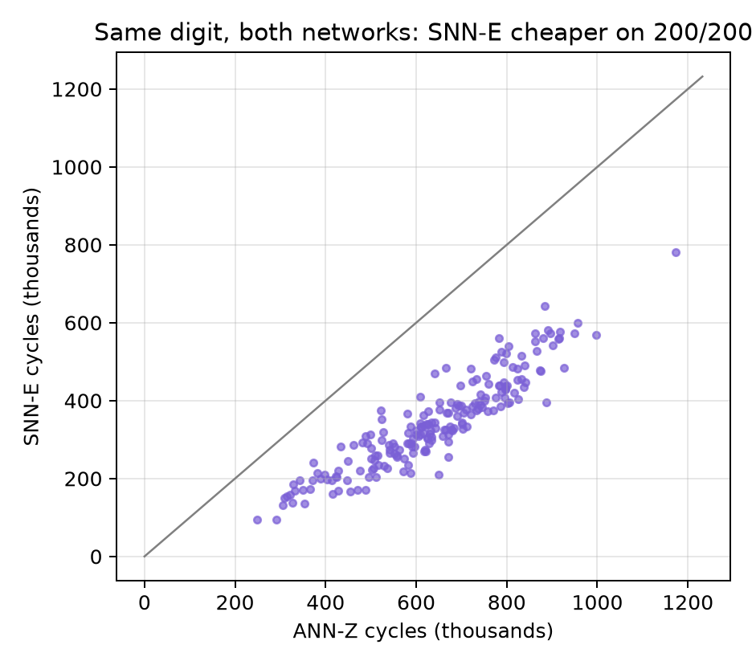
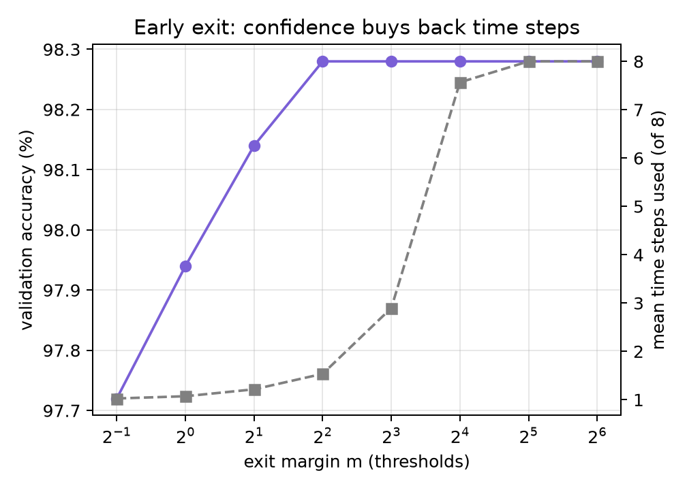

# The evidence

All numbers come from scripts in `training/`; rerun `python prove.py` to regenerate this file.

## 1. Accuracy: is the spiking network as accurate as the ANN?

Int8 models exactly as the Pico runs them, all 10,000 MNIST test digits, each seen by both networks.

| network | test accuracy |
|---|---|
| ANN | 98.26% |
| SNN-E | 97.98% |
| SNN-L | 98.08% |

Difference SNN-E minus ANN: **-0.28 points** (standard error 0.12).
Digits only the ANN got right: 84; only SNN-E got right: 56. McNemar exact test: p = 0.022 (the difference is statistically significant at 5%).
Equivalence (TOST): within +/-0.5 points, p = 0.031 -> equivalent. Within +/-0.3 points, p = 0.43 -> not shown.

## 2. Work on the Pico: the compiled firmware, emulated

Cycles per digit, emulated Cortex-M0+ (cycle_audit.py, 200 test digits; Poisson on fewer):

| network | cycles per digit | ms at 125 MHz | compared with dense ANN | compared with ANN-Z |
|---|---|---|---|---|
| ANN | 3,367k | 26.94 | same | 5.26x MORE work |
| ANN-Z | 640k | 5.12 | 5.26x less work | same |
| SNN-L | 677k | 5.42 | 4.97x less work | 1.06x MORE work |
| SNN-P | 6,241k | 49.93 | 1.85x MORE work | 9.75x MORE work |
| SNN-E | 345k | 2.76 | 9.77x less work | 1.86x less work |

Paired over the same digits: SNN-E / ANN-Z = **0.538** (bootstrap 95% CI 0.527 to 0.549); SNN-E is cheaper on 200 of 200 digits (sign test p = 1.2e-60).
The INA226 measures the real energy; first order, energy = active power x cycles / clock (MATHS.md 8.3).

## 3. The same operations on two kinds of hardware

| network | multiply-adds | spike additions | neuron updates | 45 nm arithmetic energy | Pico cycles |
|---|---|---|---|---|---|
| ANN | 238,200 | 0 | 0 | 54.8 nJ | 3,367k |
| ANN-Z | 46,895 | 0 | 0 | 10.8 nJ | 640k |
| SNN-L | 0 | 37,814 | 4,960 | 2.1 nJ | 677k |
| SNN-E | 0 | 28,482 | 427 | 0.9 nJ | 345k |

On custom 45 nm silicon an addition costs about a seventh of a multiply-add, so every SNN looks far better; on the Pico the single-cycle multiplier makes them nearly equal (12 vs 13 cycles), and only doing FEWER operations helps. That is the design principle behind SNN-E.

## 4. Why SNN-E wins

